# Capturas de ejemplo · Keeper 3.1

[Volver al proyecto](../README.md)

Capturas de la interfaz real con configuración demo: nombres, métricas y contenidos de ejemplo. Las vistas de las cinco pantallas se generan en la app; no son capturas del Times Gate físico. La vista móvil corresponde al navegador a tamaño de teléfono, no a una instalación validada en Android/iOS.

## Composición de cinco pantallas

Reloj, monitor del PC, texto, tiempo y tráfico de red, con contenido y color independientes.

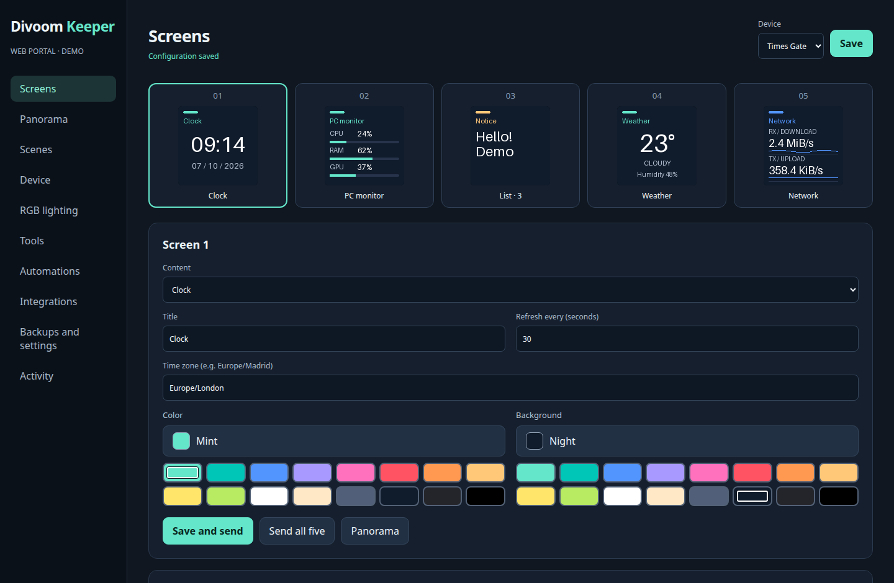

## RGB en escritorio

Escritorio 3.1.1: vista previa, brillo, seis ambientes, efectos con nombres por zona y acceso directo al color fijo trasero.

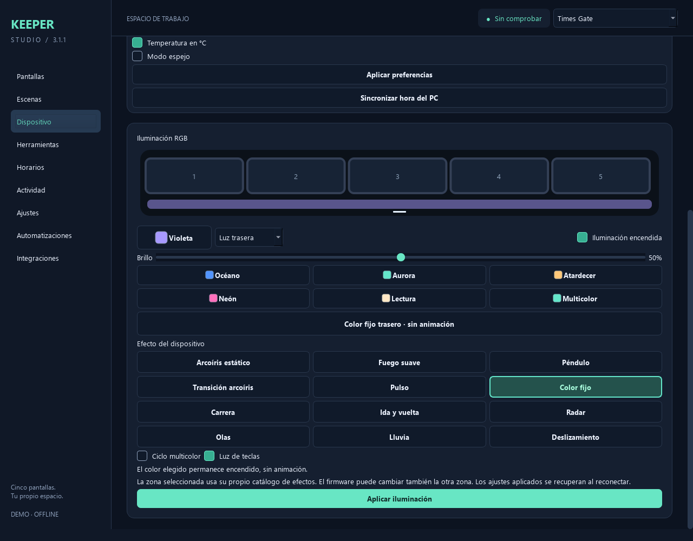

## Selector de color

Paleta, tono y saturación/luminosidad. Usar color confirma; Cancelar conserva la selección anterior.

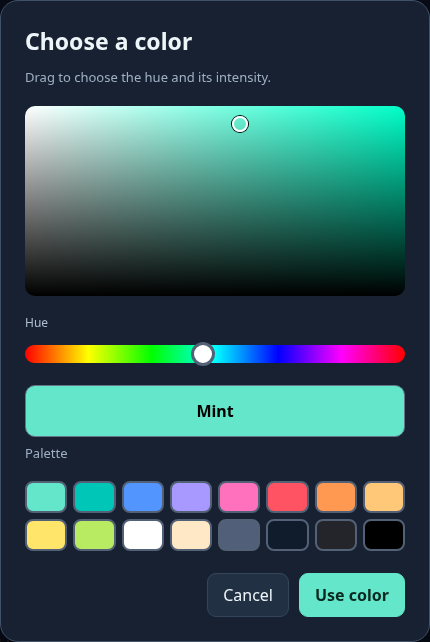

## RGB en el portal web

La misma configuración desde el navegador, con vista previa antes de aplicar.

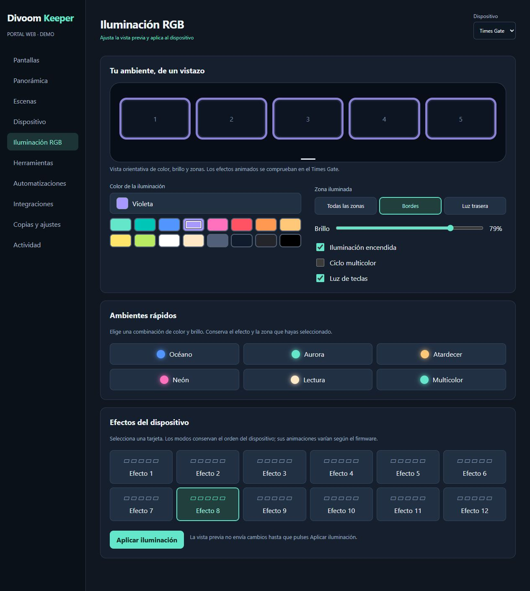

## Tamaño de teléfono

Selector compartido por el portal y las apps autónomas. La captura utiliza el portal en demo.

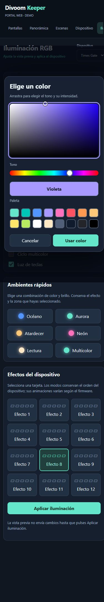

## Panorámica de vídeo

Inicio, duración, FPS, recorte, posición y zoom; vista previa de las cinco partes animadas.

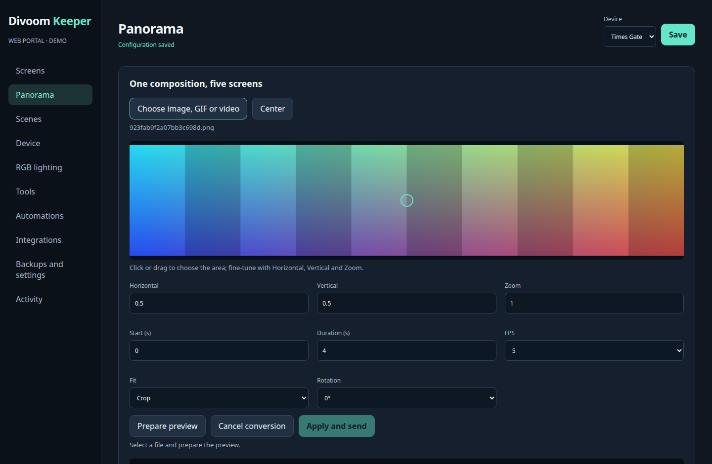

## Monitor PC

Gráficas e indicadores; las métricas ausentes se muestran como N/D en uso real.

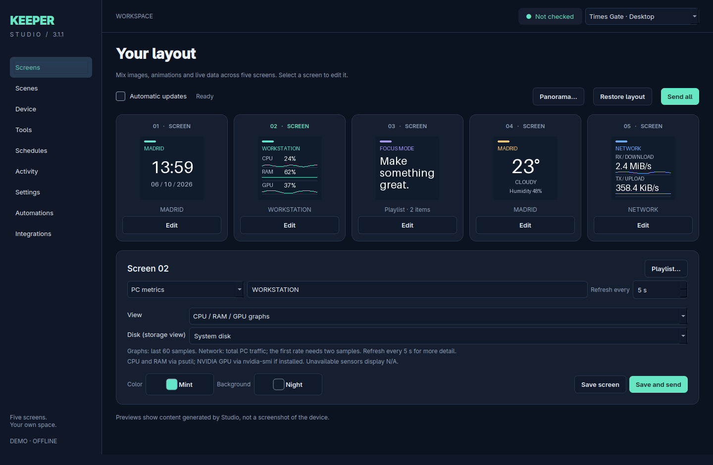

Vistas de resumen, gráficas, red, temperaturas y almacenamiento con datos de ejemplo:

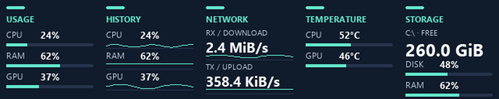

## Diseñador

Texto, imágenes y barras, selección de capas y métricas dinámicas.

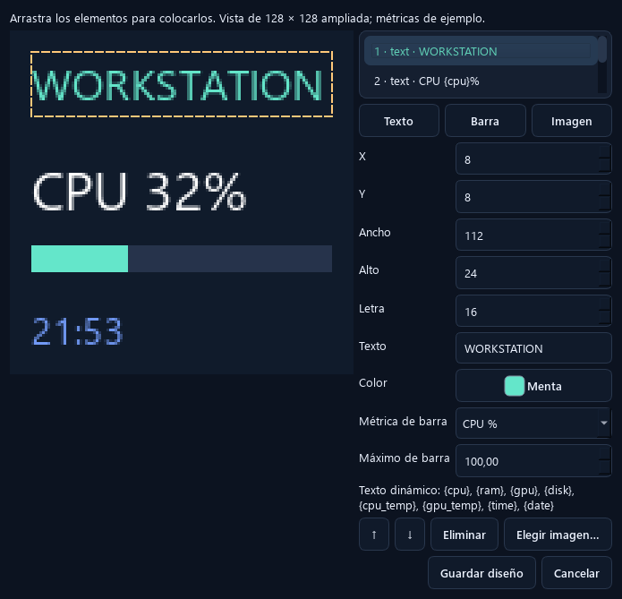

## Listas independientes

Cada pantalla alterna sus propios elementos y duraciones.

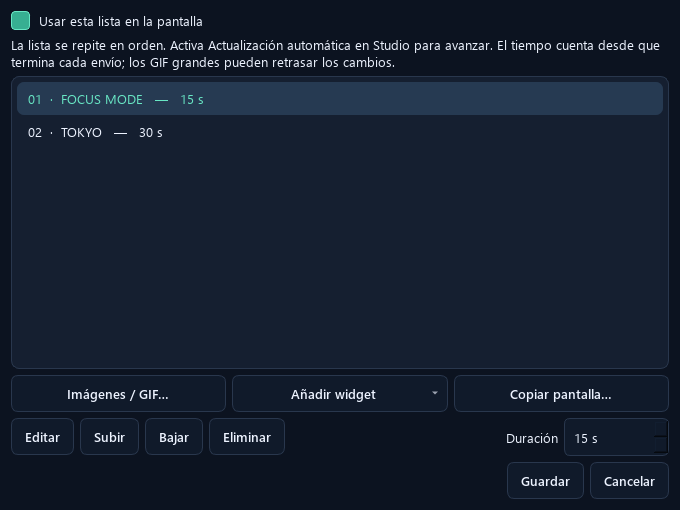

## Escenas

Composiciones guardadas y rotación de escenas seleccionadas.

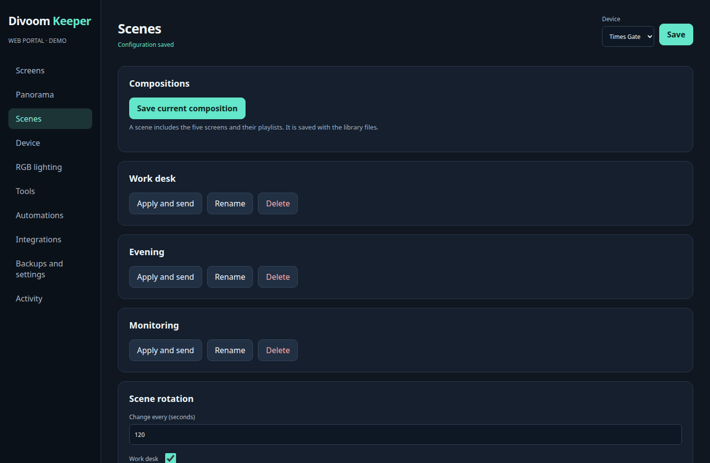

## Automatizaciones

Pomodoro, perfiles, alertas y recordatorios.

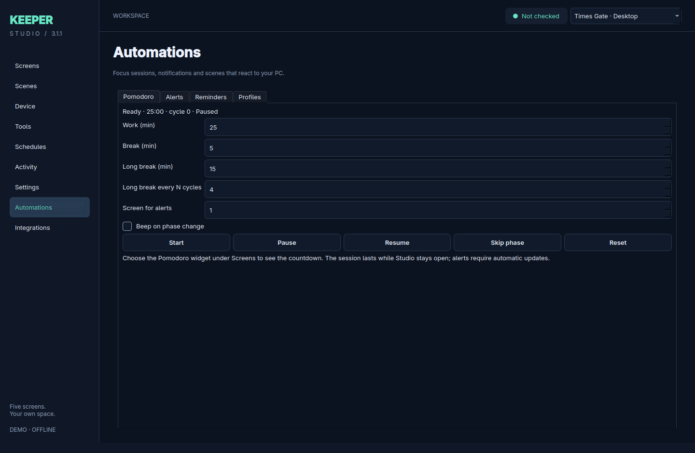

## Integraciones

API local y MQTT/Home Assistant, desactivados inicialmente. Captura demo sin credenciales utilizables.

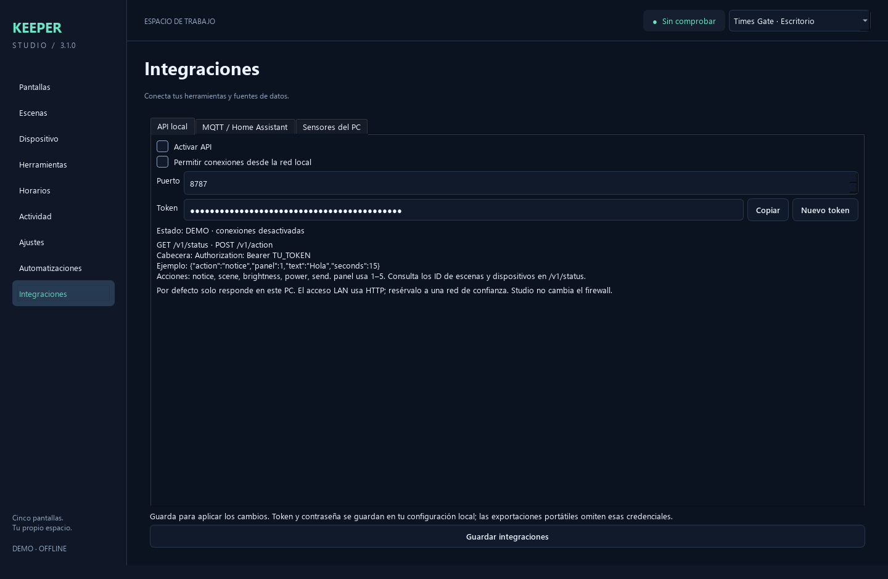

## Tema claro

El escritorio permite cambiar entre tema oscuro y claro.

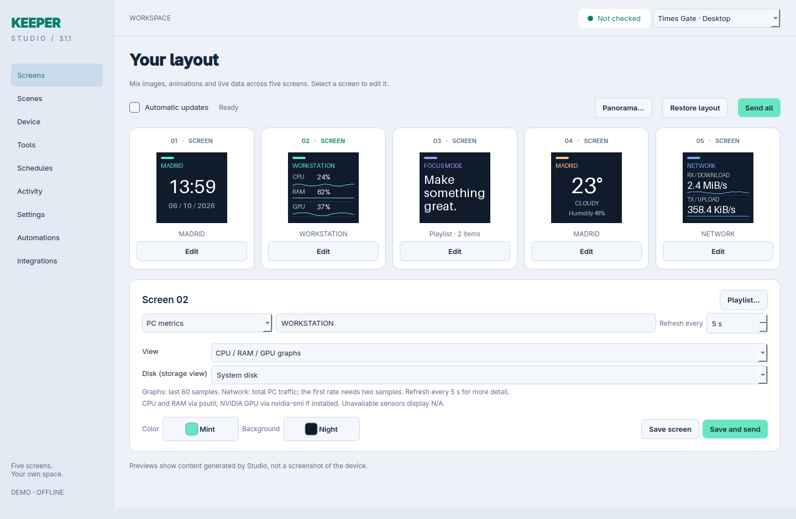
